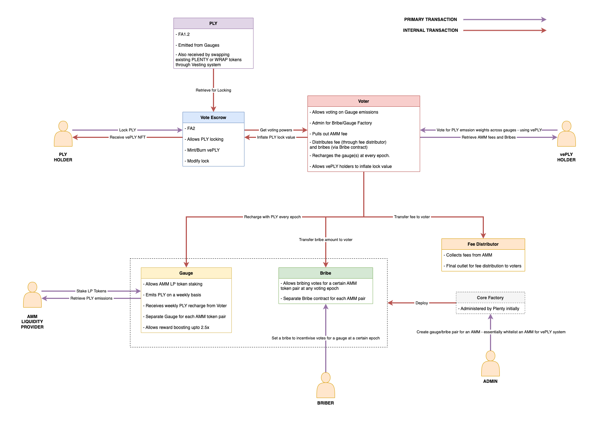

# Architecture

We explain the integral parts of the overall architecture in terms of user interactions with the system and breaking down the sequence and working of possible actions.

## PLY Holder

**PLY token** is based on the FA1.2 standard on Tezos. PLY holders can lock their PLY tokens for integral number of weeks between 1 and 208. Lock-up period is rounded to the nearest whole week as `(Expiry // Week) * Week`, so the lock period can be slightly (always < 7 days) higher or lower than the number of days your chosen number of weeks resolve to.

Lock up is done by calling `create_lock` entrypoint in `VoteEscrow` contract. The entrypoint pulls the required number of PLY tokens from your balance and in return you get a **veNFT** (also called a vePLY NFT) that represents your lock.

Each veNFT has an associated **voting power** that is linearly decreasing as `bias - slope * t`. The slope is calculated based on your PLY lock-up value and lock-up period.

At its core, the `VoteEscrow` contract is based on the FA2 standard. It maintains a `ledger` that keeps track of the ownership of all veNFTs. Only the owner of a veNFT can unlock it after expiry and redeem the underlying PLY tokens by calling the `withdraw` entrypoint.

## veNFT Holder

A **veNFT** holder can vote on the distribution of weekly PLY emission across the `Gauges`, and in return collect fees and bribes for the AMM they vote for. This is explained well with examples in the [Scenarios section](https://github.com/Plenty-DeFi/ve-core/blob/master/docs/Scenarios.md). Besides, the holder can also claim inflation for their locked PLY, that is proportional to the global supply inflation. This is required in order to prevent dilution of locked stake overtime.

Every veNFT has a voting power that can be retrieved through the `get_token_voting_power` onchain view in the `VoteEscrow` contract. The voting power can be distributed as voting weights across different gauges the owner is intending to receive fees from and direct emissions to.

Voting is handled by the `Voter` contract. veNFT holders can call the `vote` entrypoint at each `epoch` to distribute their voting power (i.e vote) for the AMMs of their choice.

An `epoch` is a voting period that is a week long and ideally starts at every Thursday, 12 AM (UTC). When a veNFT holder votes, their voting power at 12 AM (UTC) on the past Thursday is used.

Once a previous epoch is over, the next epoch can be started by permissionalessly calling the `next_epoch` entrypoint in `Voter`. Besides updating the epoch, this entrypoint also calculates and updates current PLY inflation value, and adds a proportional inflation to the PLY lockers.

To claim bribes and AMM fees for a specific epoch, the veNFT holder (who has voted) can call the `claim_bribe` and `claim_fees` entrypoints respectively, in `Voter`. These entrypoints send internal transactions to `FeeDistributor` and associated `Bribe` contract, and they in turn transfer the required amount to the holder.

To claim inflation, the holder can call `claim_inflation` entrypoint in `VoteEscrow`, once for every epoch. The inflation is added directly to the underlying lock with the bias and slope being adjusted.

## AMM Liquidity Provider

**AMM Liquidity Providers** can stake their LP tokens in the `Gauge` associated with their AMM and receive PLY emissions. The `Gauge` contracts essentially acts like a farm for PLY tokens. Every week, the `recharge_gauge` entrypoint of the `Voter` contract can be called to recharge a specific gauge, based on the emissions and gauge weights of the last epoch.

Stakers can also **boost** their emission rewards by a **maximum of 2.5x** by attaching a veNFT that they own, to their stake. Boosting is achieved using the following formula: `MIN(Staked-Balance, (0.4 * Staked-Balance) + (0.6 * Staked-Supply * Voting-power-of-veNFT / Total-voting-power))`

## Briber

An individual or even a protocol can bribe i.e essentially reward those who vote for a pool of their preferrence in a particular epoch.

Every AMM has an associated `Bribe` contract that handles the process. Bribes can be given in any FA1.2 or FA2 standard based token by calling the `add_bribe` entrypoint.

## Admin

The `CoreFactory` contract has control over addition/deletion of AMMs in the vote-escrow system. The factory is controlled by Plenty's multisig.

When a new AMM is added, the associated `Gauge` and `Bribe` contracts are deployed and the AMM and it's token pair is recorded in `Voter` and `FeeDistributor`.

## Architecture FAQs

### How is the voting power calculated in VoteEscrow contract?

In order to calculate the voting power of a specific veNFT, or the global voting power at any timestamp **t**, we record **checkpoints** whenever any operation related to the vote-escrow mechanism takes place. These operations include creation of a lock, increment of lock value and increment of lock period.

These checkpoints are recorded in `token_checkpoints` and `global_checkpoints` bigmap. Further to keep track of lock expiry, we keep the `slope_changes` bigmap.

To find the voting power at any specific timestamp, we binary search through the checkpoints to a timestamp closest to required, and extrapolate the values stored in the checkpoint to calculate voting power at the given timestamp.

### How is boosting achieved in Gauges?

The staked balance of the user is dialled down and kept in the range 40%-100% of the initial balance. This is stored as `derived_balances` and its associated `derived_supply`. The dialing down is achieved using the formula stated in the **AMM Liquidity Provider** section. The derived values are further used to calculate the emission share.

For stakers who do not attach a veNFT to their stake, their derived balance is always 40% of the staked balance. To get maximum out of their stake i.e a 2.5x boost, they have to attach a veNFT with enough voting power to their stake.

### How does 'attaching' affect the veNFT?

When a veNFT is attached to an LP stake in a particular gauge, it becomes un-transferrable and cannot be used as boost in any other gauge.

### Why are timestamps stored as `nat`?

The operations in the VE system require a ton of arithmetic calculations to be made on timestamps. Since Michelson `timestamp` is not versatile when it comes to arithmetic calculations, `nat` is chosen at the primary type to store UNIX timestamp values.
